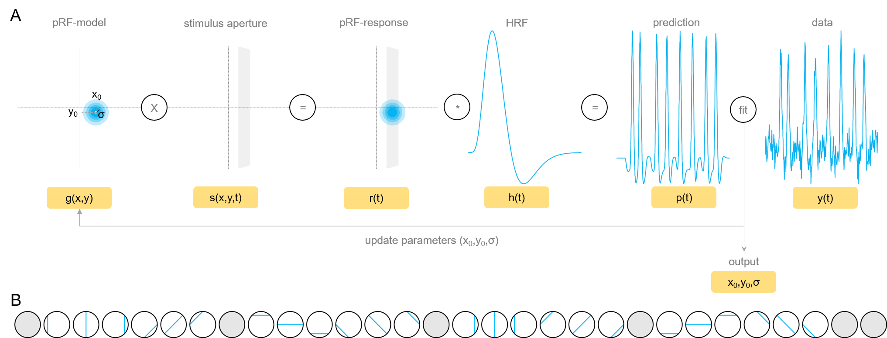

\newpage

# Table of Contents

- [Table of Contents](#table-of-contents)
- [Acquisition - the principles](#acquisition---the-principles)
  - [General outline](#general-outline)
  - [Session 1 - anatomy and pRF-mapping](#session-1---anatomy-and-prf-mapping)
  - [Session 2 - surface and pRF-based line planning](#session-2---surface-and-prf-based-line-planning)
- [Acquisition - the practicals](#acquisition---the-practicals)
  - [Session 1](#session-1)
    - [Before the subjects arrives](#before-the-subjects-arrives)
    - [Subject has arrived](#subject-has-arrived)
    - [Subject is in the scanner](#subject-is-in-the-scanner)
    - [After the session](#after-the-session)
  - [Intersession data processing](#intersession-data-processing)
  - [Session 2](#session-2)
    - [Switching to surface coils](#switching-to-surface-coils)
    - [Subject is in the scanner (2)](#subject-is-in-the-scanner-2)
- [Dealing with line-scanning data](#dealing-with-line-scanning-data)
  - [Preprocessing](#preprocessing)
  - [Analysis](#analysis)
    - [pRF-modeling](#prf-modeling)
- [Acknowledgments](#acknowledgments)
- [References](#references)
- [Supplementary Materials](#supplementary-materials)

\newpage

# Acquisition - the principles

## General outline

To increase the homogeneity of the signal across cortical layers during line-scanning[@Raimondo2021], it is desirable to intersect the cortex at a point where the curvature is minimal. Additionally, to optimally stimulate a particular part of the cortex during the experiments, it is important to delineate the visual cortex in its constituent parts. Combining these two elements, you can obtain a flat piece of cortex within a certain visual field. How do we obtain these elements for an optimal planning of the line during experiments? We can do this by performing two scan sessions for each participant (see figure 1). In the first session, we acquire high resolution anatomical scans in addition to a population receptive field (pRF-) mapping paradigm (Dumoulin & Wandell, 2008), while the second session will be based on the information analyzed offline after the first session. Let’s take a more detailed look at what that entails.

![*Figure 1*. **Overview of the multi-session line-scanning with optimal planning by combining structural and functional information**. The first session consists of anatomical and functional imaging to delineate the subjects’ surface and population receptive fields (pRFs). This will result in a point on the vertex and surface normal perpendicular to that vertex, basically representing the orientation of the line. By calculating the angles with each of the cardinal axes, we can obtain the orientation of the line in the first session anatomy. Session 2 starts off with a quick MP2RAGE with the volume-coil, which is exported from the scanner and registered to the first session anatomy on-site. Because we know the orientation (i.e., a first set of translation and rotation values) in the first session, and we now know how session 2 has moved relative to session 1 (i.e., a second set of translation and rotation values), we can derive which values to insert in the MR-console to get the line oriented exactly as it should in session 1 (see text for more details).](figs/workflow1.png)

## Session 1 - anatomy and pRF-mapping

The first session will consist of a high resolution MP2RAGE scan and a pRF-experiment during the acquisition of regular whole-brain gradient-echo T2*-weighted EPI-images and the Nova coil. Upon completion of the first session, the anatomical and functional data will be processed with fmriprep including surface reconstruction via FreeSurfer. From the surface reconstruction, the minimal curvature can be calculated and imported in Pycortex. The anatomical images will also be processed to segment tissue types and layers using nighres, while the preprocessed functional images will be processed with prfpy to obtain pRF parameters. These parameters will be combined with the minimal curvature in pycortex. We then basically have the two pieces of information: the minimal curvature and the delineation of the visual field. In pycortex, we can locate a visual field by tweaking the criteria for the pRF-parameters: we can specify that we want pRFs with a certain size, eccentricity and polar angle and create a binary mask containing all points in the brain than conform to these criteria. We can mask this with a mask of V1, to obtain all pRFs within V1 that meet the criteria. This mask we can apply to the minimal curvature map to extract the vertex containing the least amount of curvature that meets the pRF-criteria. By calculating the vertices around that vertex, we can calculate the normal vector (perpendicular to vertex) that should be our line orientation.

Based on the vertex location, we know where the line should pass through. That is, we have its translation values. The normal vector (perpendicular to the vertex) already provides us with clues about what orientation the line should have. Here is where a little trigonometry will kick in. More specifically, the cosine-rule to obtain the angle between two vectors. First, we will define each cardinal axis (x [RL], y [AP], and z [FH]), so that $v_{x}=\begin{bmatrix} 1 & 0 & 0 \end{bmatrix}$, $v_{y}=\begin{bmatrix} 0 & 1 & 0 \end{bmatrix}$ and $v_{z}=\begin{bmatrix} 0 & 0 & 1 \end{bmatrix}$. Using (eq 1), we can calculate the angle with each axis by inserting the vectors vx, vy, and vz one-by-one as b, while inserting the normal vector as a (the cosine of the angle between two vectors is equal to the dot product of these vectors divided by the product of the vector magnitudes).

\makebox[\linewidth]{$\cos_{\theta}=\frac{\gamma\cdot\beta}{|\gamma|\cdot|\beta|}$ (eq. 1)}

It does not matter what the vectors in the denominator are, the product of the magnitudes will always be 1 due to the nature of unit vectors. For the nominator, the value will correspond to $i^th$ element of the normal vector: for the x-axis, this is the first value, for the y-axis the second, and for the z-axis the third. This results in rotation values (the angles of the line with each axis) and the translation values (position of the vertex). Now we can construct the values required to get the line in the correct orientation in the first session anatomy. This is made slightly more complicated because of all the different coordinate systems that are used by different softwares and the scanner. Unfortunately, we can’t just input the obtained values in the MR-console, because the scanner will flip the orientation of the slice/line when the angles are too big. For instance, if we start out with a coronal orientation of the slice/line, and we insert a value greater than 45° (e.g., 68°) in the FH-box ( = 68° around the FH-axis), the slice orientation will be flipped to sagittal and the 68° will change. Thus, we need to convert the angles to MR-console appropriate angles by deriving what the orientation should be and how this changes the angles.


## Session 2 - surface and pRF-based line planning

The second session will be performed with a surface coil, to increase sensitivity in the posterior regions of the brain. So now it is a matter of transforming the results from the first session to the second session. For this, we will start the second session with a quick low resolution (1.5mm isotropic) MP2RAGE using the volume coil. As soon as the acquisition is done, we export the data and register the first session anatomy to it resulting in a third set of rotation and translation values. Combining these sets of rotation and translation values we can transform the line positioning into the second session. We insert the values obtained from the registration into the MR-console when loading up the single slice and 14 slice partial anatomy sequences. For these sequences, we just need to set the rotation and translation. Only the line-sequence requires the specification of the slice orientation and foldover direction as well.

# Acquisition - the practicals

## Session 1

### Before the subjects arrives

- **Is the BOLD screen on?** 
    Check if the BOLD screen is turned on at the back of the scanner bore. If not, flip the switch near the computers on the right with the label “BOLD SCREEN”. This will turn on the screen.

- **Which system is active, the Classic or the MultiX?**
    Check the box on the right of the door to the scanner. If so, open a terminal on the second display from the left (the outer left one is the Classic-system, the one to the right of that is the MultiX system) and type “permproc”. This will show which processes are running. If the “scanner” is “running”, then click on the icon “StopScanner.bat” on the desktop. 

- **What coil is installed, the Classic or MultiX?**
    Check which coil is installed. The Classic Nova coil is characterized by the two boxes connected by 32 channels, while the MultiX coil is one piece. If the MultiX is connected, disconnect the 3 channels which connect the coil with the scanner bed. Then lift the coil onto the bed, this makes moving the coil from the bed to the cabinet on the right (facing the scanner) easier. Then get the Classic Nova coil, which should be positioned on a little cart on the left of the scanner room (again facing the scanner). Lift the coil onto the bed and connect the cables. Leave the scanner room and flip the switch from MultiX to Classic if necessary!

- **Start the Classic and select patch if needed**
    Once you are seated behind the control computer,  click on the icon “StartScanner.bat” on the desktop. This will launch the scanner for us. Then, press the “Smart Patch” icon to check if there is a patch loaded. If so, press “1” to remove the current patch. As of this moment we are not using a patch, so this action suffices for now. However, once we start using patches later on, you need to select the patch by entering the corresponding number. Once the patch is loaded or deselected, open a terminal and enter “logd”. This will show the processes that are going on. We want to wait until we see the indication of “humidity” and “temperature”, which marks the moment the scanner has finished booting. We can now start the MRBootConfig by selecting “application” and clicking “start”.

### Subject has arrived

- **Screen your subject extensively**
  No magnetic objects are to be anywhere NEAR the scanner, so it is important to screen your subject elaborately.  The screening consists of three parts: (1) the screening form, (2) the magnetic detector on the wall, and (3) a verbal check. If everything is OK, bring the subject into the MR-room. Upon arrival, hand over the screening form and declaration for the general practitioner (1). The latter is compulsory and important for incidental findings. If everything is OK, the subject can come in and change into MR-compatible gear provided by Spinoza. These clothes are not the most fashionable, but they do the job. You can find these at the left corner of the control room in the top cabinet. Hand them over to the subject and have them change in the changing room. Once the subject is changed, have them perform their best twirl in front of the magnetic detector on the right of the MR-control room (2). No lights or beeps should be observed. If this is also OK, verbally check the subject once more by checking from top to bottom (3): have them go through the hair for hair clips, down to the face for piercings/necklaces/etc, down to the waist for belts or pocket stuff (which should not be the case since they have changed in Spinoza gear), down to the toes for ankle bracelets and other stuff. 
- **Position your subject**
  Now we can position the subject in the scanner. Hand over the earplugs and hairnet to the subject and place them on the bed. Gently lower the subject so that the head is nicely positioned in the coil, as far back as possible for maximum sensitivity. Make sure the mirror for the stimulus screen is positioned properly by asking whether the subject can see the majority of the screen. It’s not necessary to see every corner, as long as the majority of the screen is visible. Now attach the PPU that is under the bed for physiological monitoring and apply the breathing belt on the belly of the subject. Wrap the band around the breathing belt for stability. Hand over the alarm bell and check whether the subject is comfortable. Sometimes they want a blanket over the feet or something, check this with your subject. If everything is OK, move the subject to the isocenter of the bore: press the “IN” bottom at the head of the table to move the subject in. Do this until the two labels (one on the bed and one on the bore itself) match up. This means the subject is located at the isocenter of the scanner. 

### Subject is in the scanner

- **Register patient**
  Once you have returned to your seat in the MR-control room, check up on your subject by asking how things are going. You can communicate via the white box on your right. If everything is OK, ask the subject to press the alarm bell to make sure it works properly. This will result in a loud beep that you can stop by pressing the button on the box you are communicating with. For the registration of the patient you need the weight of the subject. The tolerable amount of energy absorption (energy entering the body; SAR) will be calculated based on this. Ask the weight and inform the subject you are going to prepare the scans and that you will get back to him/her later. Press “patient” > “new registration” and fill in the following information:
  - [x] Name: sub-xxx_ses-1
  - [x] Registration ID: sub-xxx_ses-1
  - [x] Date of birth (fill in 01/01 for day and month): 01-01-xxxx
  - [x] Gender: M/F/O
  - [x] Weight (this you just asked): XX
  - [x] Performing physician (your initials): GJ
	
  If all is OK, press “*confirm and proceed*”.

- **Run prescans**
  Now we can start acquiring some data. In the bottom panel go to *SC > MicroFunc* and press the **+** on the right of the exam card. This will show the sequences on that exam card. We can load in all the prescans including the survey, the B0-map, and the reference scan. Before the B0-map, open *mrcodetools* so that the cache is cleared and run the sequence. Then load the reference scan and check whether the values from mrcodetool match the ones in the *dyn* tab. We don’t need to do much planning on these sequences, just **accept** and **start** these sequences.

- **Structural scan**
  After the prescans we can start acquiring the high resolution MP2RAGE sequence. This sequence takes about 12 minutes, so ask the subject if he/she would like to watch something while the scanner runs. You can set this on the stimulus computer on the right, close to the BOLD-screen switch. 

- **pRF-mapping paradigm**
  After the anatomical scan we will perform several runs of pRF-mapping. Activate the conda environment with conda activate marco_PRF. The experiment is located in `/home/marco/pRF_Experiment-Checkerboard/Experiment`, from which we can run `python main.py sub-xxx ses-x task-2R run-x`. This will output log files for this specific run. 
   
### After the session

Upon completion of the pRF-mapping, we are done with session 1 which means we can go get the subject out of the scanner. Inform the subject that you are coming. Make sure to remove all the magnetic materials from yourself and enter the scanner room. Press “OUT” on the table head to move the table out of the scanner bore. Retract the coil and let the subject get up slowly to avoid dizziness from the magnetic field. The subject can now go change in their regular clothes while you clean up the MR-room with alcoholic wipes. Clean everything you or the subject has touched: the coil, the bed, the PPU, the breathing belt, and the alarm bell. Once you have done this and the subject has changed, thank the subject with your dear life for participating and show him/her how to leave the building. After the subject has left, export the data.

Open `gtpackngo` from the start-menu and select the sequences you want to export: we do not care too much about the prescans, so just export the anatomical scans and the functional data (also include DICOMDIR for later slice orientation verification). Export the data by clicking on “local disk” and make a new folder called `W:/Export/tmp_dir`. Then copy the folder to `H:/scdropbox/Jurjen`. Confirm and wait until the data has been exported. Then, close the patient and shut down the system. If someone after you has booked a session on the Classic-system, you can leave the scanner as is. In all other cases, we need to switch to MultiX again: press **StopScanner.bat** on the *left* computer to stop the Classic-scanner. Then, switch the coils and flip the switch to MultiX. Start the MultiX by pressing **StartScanner.bat** on the *right* computer.

## Intersession data processing

Before we head on to session 2, the data from session 1 needs to be processed so that we get the desired information for session 2. Specifically, we need a surface reconstruction and a file “/derivatives/prf/sub-xxx/sub-xxx_desc-prf_params.npy” containing the parameters of the pRF-analysis for now. For this we use the [linescanning](https://github.com/gjheij/linescanning/tree/main) package. Please follow the instructions [here](https://linescanning.readthedocs.io/en/latest/installation.html) to setup the package properly. We can perform all our preprocessing steps using the `master`-script. For each module, the scripts will by default loop through all available subjects. To limit modules to one subject, you can specify the `-s <subject ID>` flag. This is the ID after the ``$PREFIX`` variable as specified in the `spinoza_setup` file.

1. **Convert the data to nifti**. The first session we can convert using `call_pydcm2niix` (which is basically Marco’s `FromScannerToBIDS` script, but then slightly more flexible regarding directory input), which for the second session we’d use `call_dcm2niix` which is tailored for our line-scanning protocol. You can set the `-n` flag after `master` to specify which session we need to convert. So for session 1, we’d enter:
  ```bash
  master -m 02 -n 1 # -s <subject ID>
  ``` 

2. **Run FreeSurfer to create the surface reconstructions** needed to calculate the minimal curvature. We could also let fmriprep do this in the next step, but we use a newer version that is better suited for our data. It will take a while for this step to finish.
  ```bash
  master -m 14 # -s <subject ID>
  ```

3. **Run fmriprep on the anatomical and functional data**. It preprocesses the functional data to be ready for pRF-analysis using the output from the FreeSurfer reconstructions. 
  ```bash
  master -m 15 # -s <subject ID>
  ```

4. **Run pybest to denoise your data with the confounds as outputted by fmriprep**. 
  ```bash
  master -m 16 # -s <subject ID>
  ```

5. **Perform the pRF-fitting**. For this we need the design matrix in the pRF-folder and the denoised output from pybest. If there is no design matrix in the pRF-folder, we need to specify the path to the screenshots in the variable `path_png`. A design matrix will then be created. This notebook will output a `sub-xxx_ses-1_model-<gauss|norm>_stage-<grid|iter>_desc-prf_params.npy` file to the subject’s prf-folder:
  ```bash
  master -m 17 # -s <subject ID>
  ```

This script will look for a screenshot directory that you have placed (if you followed this manual) in `project/xxx/sourcedata/sub-xxx/ses-1/prf`.
Run spinoza_bestvertex to get the `line_pycortex.csv` file. This script includes an iterative process to get the desired pRF. Upon starting, it will import the FreeSurfer subject into Pycortex and ask you to give cut-off values for `eccentricity` and `r2`, `size`, `sulcal depth` and more. With this information, a mask is created that is applied to the curvature map. From there, the vertex with the least amount of curvature (closest to 0) will be selected. To verify it's location, `FreeView` will be opened with `fiducial`-surfaces on the location of the coordinate of the vertex. If you are happy with the positioning, press **y** and the script will write the line_pycortex.csv file. If not, press **n** and adjust the parameters. 
```bash
master -m 18 # -s <subject ID>
```

This will give us all the ingredients we need for starting the second session.

## Session 2

For the preparation steps we refer back to [Before the subjects arrives](#before-the-subjects-arrives) and [Subject has arrived](#subject-has-arrived). The thing that is different with the second session is the usage of the surface coil, rather than the 32-channel Nova coil.

### Switching to surface coils

As previously mentioned, most people will be using the MultiX-system for their experiments. We are using the Classic system. To boost SNR, we're also using the surface coils. These are coils dedicated to a specific area of the brain depending on where you position it. Instead of having 32 channels around the brain, you will redirect these channels locally. Follow these steps to switch to surface coils:

1. ..
2. ..
3. ..
  
### Subject is in the scanner (2)

- **Register patient**
  Once you have returned to your seat in the MR-control room, check up on your subject by asking how things are going. You can communicate via the white box on your right. If everything is OK, ask the subject to press the alarm bell to make sure it works properly. This will result in a loud beep that you can stop by pressing the button on the box you are communicating with. For the registration of the patient you need the weight of the subject. The tolerable amount of energy absorption (energy entering the body; SAR) will be calculated based on this. Ask the weight and inform the subject you are going to prepare the scans and that you will get back to him/her later. Press “patient” > “new registration” and fill in the following information:
  - [x] Name: sub-xxx_ses-1
  - [x] Registration ID: sub-xxx_ses-1
  - [x] Date of birth (fill in 01/01 for day and month): 01-01-xxxx
  - [x] Gender: M/F/O
  - [x] Weight (this you just asked): XX
  - [x] Performing physician (your initials): GJ
	
  If all is OK, press “*confirm and proceed*”.

- **Structural scan**
  After the scout we directly start with a low resolution anatomical scan. Because we're using the surface coils, we cannot use the accelerating properties of the NOVA coils for whole-brain acquisitions as we need to use the volume coil transmit/receive settings. That doesn't matter, as we only need the contours of the brain to register the `ses-1` anatomy to the `ses-2` anatomy. This acquisition is about 4 minutes. 

- **Shimming & ref scan**
  After the anatomical scan, run the B0-map and the ref scan, and do the shimming with `MRcodeTool`. 

- **3DEPI BOLD**
  Now we start up a quick partial FOV 3DEPI BOLD with pRF-mapping while we export the structural scan for registration. This minimizes dead time and adds and extra confirmatory step to our pRF selection. 
  
- **Ses-1 to ses-2 registration**
  While the acquisition is running, export the `WIP`-files of the anatomical scan to `W:/Export/tmp_planning`, and from there to `H:/scdropbox/Jurjen`. Now, make sure you're connected to `guacamole` with your local laptop (we cannot do this on the host computer of the scanner!). Enter:

```bash
# define subject and session IDs
sub_ID=<sub ID>
ses_ID=<ses ID>
hemi=<'left'|'right'>

# copy exported files
mkdir -p $DIR_DATA_SOURCE/sub-${sub_ID}/ses-${ses_ID}/planning
cp /data2/scdropbox/Jurjen/tmp_planning/* $DIR_DATA_SOURCE/sub-${sub_ID}/ses-${ses_ID}/planning

# run the spinoza_lineplanning module
master -m 00 -s ${sub_ID} -n ${ses_ID} -h ${hemi}
```

This internally calls:
```bash
subject=${PREFIX}${SUB}
spinoza_lineplanning ${OW} \
                    -s ${subject} \
                    -n ${ses_nr} \
                    -i ${DIR_DATA_SOURCE}/${subject}/ses-${ses_nr}/planning \
                    -p ${DIR_DATA_DERIV}/pycortex/${subject}/line_pycortex.csv \
                    -h ${HEMI}
```

And will:

1. Register the `SUBJECTS_DIR/sub-${sub_ID}/mri/orig.mgz` to the low-resolution anatomy
2. Apply the transformation matrix to the coordinate and normal vector
3. Correct the new angles to scanner-appropriate form
4. Print out what you need to insert where in the scanner console

The output should look something like this:


Now that you have your slice/line in the right orientation, you can continue with your experiments. For each run, acquire the following:
- Slice **with** phase encoding and saturation slabs **OFF** (reference anatomy slice)
- Slice **with** phase encoding and saturation slabs **ON** (slice for reconstruction)
- Slice **without** phase encoding and saturation slabs **ON** (line-scanning)

# Dealing with line-scanning data

## Preprocessing

Similar to `ses-1`, we need to convert our data to a format we can work with. Whereas for most analyses this is `nii.gz`, line-scanning data is reconstructed into `.mat`-files. The [line-scanning](https://github.com/gjheij/linescanning/tree/main) is tailored for this type of data. But first, let's convert our data. The `-n` flag will now trigger a different script as it's not `prf` or `1`:
```bash
master -m 02 -n 2 # -s <subject ID>
```

Now we run the reconstruction following `Luisa`'s pipeline. The `-x 5` means we have a multi-echo line-scanning sequence with 5 echoes and `-j` means we want to submit our jobs to the clusters. This allows us to reconstruct the data for all runs in parallel.
```bash
master -m 03 -n 2 -x 5 -j
```

Because line-scanning data is extremely noisy, we need some additional steps to clean the data up. One method is anatomical component correction, or `aCompCor`. This regresses out the frequencies from white matter and CSF voxels. To do this, we need to know where our line was relative to the anatomy. For this, you'd say we can use the segmentations we made in `ses-1` and the registration matrix between the sessions to map the segmentations into the slice. However, this mapping is created using `FreeSurfer` input, while the segmentations are in `native` space. Thus, the dimensions are different and therefore this transformation matrix cannot be used directly. We can run the following to get the correct mapping stored in `project/derivatives/pycortex/<subject>/transforms/<subject>_ses-<ses>_from-ses1_to_ses<ses>_desc-genaff.mat`:
```bash
call_ses1_to_ses -s <subject> -n <session ID>
```

This deals with session to session transformation, but does not deal with motion between runs. We cannot observe *all* movement with our slices, but we can optimize it to the best of our abilities. We do this by manually aligning the first slice image to the slice image of subsequent runs using `ITK-Snap`. Make sure the reference image is **NOT** the slice of the first run. This is the moving image! Save the transformations as `from-run1_to-run-X.txt` in `DIR_DATA_HOME/sub-XXX/ses-X/anat`. For the first slice, we can create a similar file but then with the identity matrix using:
```bash
call_createident from-run1_to-run1.txt
```

This makes the scripting/processing later on slightly easier as we're not dealing with exceptional cases: each run has the same type of files. Now do some analysis, such as the one specified [here](https://linescanning.readthedocs.io/en/latest/examples/nideconv.html). Note that the analysis aspect of the project is still very much in progress, so stuff changes regularly. The most current implementation looks as follows (open a new `jupyter notebook` or `python script`, whichever way you like, though I recommend a notebook as it allows you to explore the structure of the data in a more accessible way):

```python
from linescanning import utils, dataset
# set some paths
func_dir = "/project/sub-XXX/ses-X/func" # has your reconstructed data
anat_dir = "/project/sub-XXX/ses-X/anat" # has your run-to-run transformation files
deriv_dir = "project/derivatives" # = $DIR_DATA_DERIV

# fetch all the files for some runs
run_files = utils.get_file_from_substring([f"sub-{sub}", f"ses-{ses}", f"{task}"], func_dir)

# from run_files, select the functional files ending with .mat
func_file = utils.get_file_from_substring("bold.mat", run_files)

# from run_files, select the single slice (without OVS) images
ref_slices = utils.get_file_from_substring([f"sub-{sub}", f"ses-{ses}", "acq-1slice", ".nii.gz"], anat_dir)

# get the registration matrix mapping ses-1 (not FreeSurfer!) to ses-X anatomy
trafo = utils.get_file_from_substring(f"from-ses1_to-ses{ses}", opj(deriv_dir, 'pycortex', f"sub-{sub}", 'transforms'))

# get the manually created registration matrix mapping the first single slice image to the run-specific single slice image
trafo_run = utils.get_file_from_substring(".txt", anat_dir)

# plop everything in Dataset
data_obj = dataset.Dataset(func_file,
                           verbose=True,
                           acompcor=True,
                           ref_slice=ref_slices,
                           ses1_2_ls=trafo,
                           run_2_run=trafo_run,
                           voxel_cutoff=300, # voxels lower than this are not considered for aCompCor as they are too far away from the coil to be relevant
                           save_as=opj(anat_dir, f"sub-{sub}_ses-{ses}"))
```

After preprocessing (filtering, standardizing, and aCompCor) each run, the probability maps are averaged, new voxel classification is made, and a separate dataframe with GM-voxels is created (`data_obj.gm_df`). We can also specify a range in which we need to look for voxels to create a dataframe just with voxels in the vicinity of our ribbon. For instance, the range can be `[355,375]`. It then looks for the GM-voxels based on the new classification within this range to create a ribbon-dataframe (`data_obj.ribbon_df`). This latter one is very compatible with the Nideconv fitting (especially the plotting part), as it's not that many voxels. 

## Analysis

We are currently running multiple experiments with the line, including `Size-Response`, `motor`, and `pRF`-experiments. The most straight forward application of line-scanning is looking at signals across depth, as we have literal voxels across the ribbon. So, no interpolation or other tricks are required to get `laminar` results. These kinds of analysis are easily implemented in the [NideconvFitter](https://github.com/gjheij/linescanning/blob/main/linescanning/utils.py#L1314) as per [this example](https://linescanning.readthedocs.io/en/latest/examples/nideconv.html). It rests on the output from the chunk of code above, and allows you to probe HRF-properties in various ways (e.g., across depth, across events, etc). The `pRF`-analysis mostly rests on a separate package which is currently not public. 

### pRF-modeling



A pRF is a quantitative model of the cumulative response of the population of cells contained within a single fMRI voxel [@Dumoulin2008]. The pRF model can be used to estimate the response properties of populations of neurons using other measures, such as EcOG and EEG. A time course can be generated from such a model by sampling the visual stimuli within the receptive field during an experiment: the position and size of a model will then generate a model time course that will exhibit positive responses each time when a stimulus falls within its recpetive field. Note that a receptive field located at another location will produce a different time course since the stimuli will usually fall in the other model's receptive field at different moments in time. Further note that a model with a larger receptive field size will be influenced by stimuli that are further away from the pRF center than an alternative model with a smaller receptive field size even if the center of the two models is located at the same position in the visual field. if "rich" visual stimuli are used, each model will, thus, produce a unique predicted time course. The predicted time courses from different pRF models can be compared with the measured time course of a specific voxel (or vertex) and the model will be selected for that voxel if its associated time course best explains the observed time course. More specifically, a generated model time course serves as a predictor in a GLM (instead of protocol-derived predictors) and the amount of explained variance is recorded. Instead of one set of protocol-derived predictors, many GLMs will be performed for a single voxel each with a different model time course as predictor in order to find the model that leads to the highest explained variance of the voxel's time course. In order to allow a proper comparison of a model time course with observed fMRI data, a generated model time course needs to be convolved with a (standard) hemodynamic impulse response function.

# Acknowledgments

Thanks, all

\newpage

# References

::: {#refs}
:::

\newpage

# Supplementary Materials


